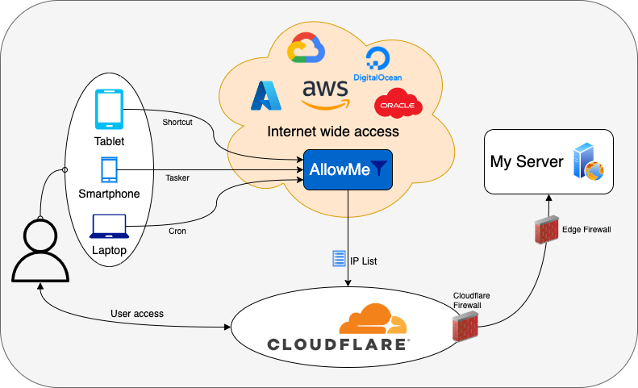

# Cloudflare AllowMe

A practical, highly configurable Node.js service / tool to automatically manage a list of allowed IPs in your Cloudflare's zone firewall. Very useful if you self-host and want to protect services like Home Assistant, Plex, WordPress etc.

- [How does it work](#how-does-it-work)
- [Setup guide](#setup-guide)
    - [Cloudflare API token](#cloudflare-api-token)
    - [Cloudflare IP list](#cloudflare-ip-list)
    - [Cloudflare firewall rule](#cloudflare-firewall-rule)
    - [Running with Docker](#running-with-docker)
    - [Running directly with Node.js](#running-directly-with-nodejs)
- [Service configuration](#service-configuration)
- [Endpoints](#endpoints)
    - [Securing with HTTPS](#securing-with-https)
- [Client configuration](#client-configuration)
    - [Tasker sample action](#tasker-sample-action)
    - [iOS Shortcuts](#ios-shortcuts)
- [FAQ](#faq)



## How does it work

It's a simple REST API that takes care of allowing and blocking IP addresses on a pre-defined IP list on Cloudflare. This list can then be used by any firewall rule. Both resources (the list and the firewall rule) are created automatically by the service, when needed.

The service must be deployed to a platform accessible from anywhere (AWS, GCP, Azure, your own VPS, etc). It listens on port 8080 by default, and has 3 main endpoints:

- `/allow` to allow the client IP
- `/block` to block the client IP
- `/banned` - return list of IPs banned due to failed authentication

You should call these endpoints (mostly the /allow) from your devices to add or remove your current IP address to the Cloudflare IP list. It supports both IPv4 and IPv6.

No cleanup is necessary, older IPs will be automatically removed from the list after a certain period of time.

Everything above is highly customizable via environment variables.

### Ultra quick start

1. Get your Cloudflare API token.
2. Prepare the environment variables:
    - `$ALLOWME_CF_ZONE` = your domain / zone.
    - `$ALLOWME_CF_TOKEN` = your Cloudflare API token with the necessary permissions.
    - `$ALLOWME_SERVER_SECRET` = your custom secret / password used to authenticate to the service.
3. Run the `igoramadas/cloudflare-allowme` Docker image with the variables above.
4. Configure your mobile devices to ping the service's `/allow` endpoint regularly, when the connection changes, or via shortcuts on your mobile launcher.
5. Enjoy!

## Setup guide

You should have a zone (domain) already registered with Cloudflare. If you don't, please follow [these steps](https://support.cloudflare.com/hc/en-us/articles/201720164-Creating-a-Cloudflare-account-and-adding-a-website).

### Cloudflare API token

Mandatory. First step is to create an API token for the service, which is needed to authenticate with Cloudflare. If you already have a token with the necessary permissions and want to reuse it, you can skip to step 6.

1. Go to https://dash.cloudflare.com/profile/api-tokens.
2. Click on the "Create token" button, then proceed to "Custom token" > "Get started". [⧉](./docs/images/api-tokens.png)
3. Give the token a name (example: AllowMe), and the following permissions: [⧉](./docs/images/api-token-create.png)
    - Account > Account Filter Lists > Edit
    - Account > Account Settings > Read
    - Zone > Zone > Read
    - Zone > Zone WAF > Edit (optional)
4. Include the account and zone resources:
    - Include > _MY_ACCOUNT_NAME_
    - Include > Specific zone > _MY_ZONE.TLD_
5. Click "Continue to summary", then "Save token".
6. Copy the token value, it will be used as the `$ALLOWME_CF_TOKEN` variable.

### Cloudflare IP list

Optional. Next you'll have to define an IP rule list to manage the allowed IPs. By default, if you don't have any IP rule lists created on your Cloudflare account, the service will automatically create an "allowme" list for you, so you can skip these steps altogether. Otherwise if you want to do it manually:

1. Go to "Manage Account" > "Configurations" on the left sidebar of your dashboard. [⧉](./docs/images/sidebar-manage.png)
2. Select the "Lists" tab. [⧉](./docs/images/ip-lists.png)
3. Click on "Create new list", give it the name "allowme", content type "IP Address". [⧉](./docs/images/ip-list-create.png)
4. Click "Create" to finish.

If you already have an IP list that you want to reuse, you can simply grab its ID.

1. Go to "Manage Account" > "Configurations" on the sidebar of your dashboard. [⧉](./docs/images/sidebar-manage.png)
2. Select the "Lists" tab.
3. Click on "Edit" next to the list name.
4. Get the list ID from the URL, to be used as the `$ALLOWME_CF_LISTID` variable: [⧉](./docs/images/ip-list-edit.png)
    - Example: https://dash.cloudflare.com/account123/configurations/lists/LIST_ID

### Cloudflare firewall rule

Optional. Pretty much like the IP list above, the service can automatically create the (WAF) firewall rule for you, but only if you have not specified a `$ALLOWME_CF_LISTID` variable manually. If you have specified it, then follow the steps:

1. Go to the zone dashboard on Cloudflare.
2. On the left sidebar, open "Security" > "WAF" (previously called Firewall Rules). [⧉](./docs/images/firewall.png)
3. Click on the "Create firewall rule" button.
4. Give it a name and the following properties:
    - Filter: "IP Source Address", "is in list", "allowme" (or the name of the list you have created manually)
    - Action: "Allow"
5. Click "Deploy" to save.

### Running with Docker

The easiest way to get this tool up and running is using the official Docker image:

```
$ docker pull igoramadas/cloudflare-allowme

$ docker run -it --name cloudflare-allowme \
             -p 80:8080 \
             -e ALLOWME_CF_TOKEN=MY_API_TOKEN \
             -e ALLOWME_CF_ZONE=MYDOMAIN.COM \
             -e ALLOWME_SERVER_SECRET=MY_SUPER_SECRET_KEY
             igoramadas/cloudflare-allowme
```

### Running directly with Node.js

First, make sure you have all dependencies installed:

```
$ npm install --production
```

Then (on the root of the application) to start the service it's as simple as:

```
$ npm start
```

If you choose to have it running directly on your environment, it's highly recommended to use a process manager, for example [pm2](https://www.npmjs.com/package/pm2):

```
$ npm install pm2 -g
$ pm2 start lib/index.js
```

## Service configuration

The service is fully configured via environment variables, either directly or via a `.env` file. Variables marked with an asterisk * are mandatory.

| VARIABLE | TYPE | DETAILS |
| --- | --- | --- |
| **ALLOWME_CF_TOKEN** * |  string | Your Cloudflare API token. Mandatory. |
| **ALLOWME_CF_ZONE** * | string | The zone which should be updated, for example "mydomain.com". |
| **ALLOWME_CF_ACCOUNTID** | string | If you have multiple accounts, you can set the ID of the correct account here. If unset, the service will use the main account. The account ID can be taken from your dashboard URL, it's the token string right after dash.cloudflare.com/. |
| **ALLOWME_CF_LISTID** | string | Optional. The IP list ID, in case you don't want to have a dedicated "allowme" list. You can get the list ID from the URL of its edit page. If set, you'll have to configure the firewall rule manually (see the "Firewall rule" section above). |
| | | |
| **ALLOWME_SERVER_PORT** | number | Web server HTTP port. Defaults to "8080". |
| **ALLOWME_SERVER_SECRET** * | string | The secret / token that you should pass to the service via the "Authorization:Bearer" header, or the "secret" query string, or as the password on the Basic Auth prompt. Mandatory. |
| **ALLOWME_SERVER_USER** | string | Username to be used on the Basic Auth prompt (see below). Defaults to "allowme". |
| **ALLOWME_SERVER_PROMPT** | boolean | Optional, set to false to disable the Basic Auth prompt so only an Authorization (Bearer) header is accepted. |
| **ALLOWME_SERVER_TRUSTPROXY** | boolean | Optional, set to false to disable parsing the client IP from _X-Forwarded-For_ headers. |
| **ALLOWME_SERVER_HOME** | string | Optional, full URL to where users should be redirect if they git the root / path of the service. If missing the https://, this will be treated as text and that text will be displayed instead. Defaults to https://devv.com. |
| | | |
| **ALLOWME_IP_MAXAGE** | number | How long (in minutes) IPs should stay in the allowed list. Defaults to 1440 (1 day). Set to 0 to disable auto removing IPs. |
| **ALLOWME_IP_BLOCKINTERVAL** | number | How long (in minutes) IPs should be blocked in case of repeated authentication failures. Defaults to 60 minutes (1 hour). Set to 0 to disable blocking. |
| **ALLOWME_IP_DENYCOUNT** | number | How many times can an IP fail to authenticate before getting blocked. Defaults to 5. Setting to 0 will block IPs on their first failed auth. |
| | | |
| **ALLOWME_LOG_LEVEL** | none, error, info | Console logging level. Set to "none" to fully disable logging, or "error" to only log errors and warnings. Defaults to "info", which logs everything. |

#### Sample .env file

```
ALLOWME_CF_TOKEN=abc123abc123999000
ALLOWME_CF_ZONE=devv.com
ALLOWME_SERVER_PORT=1234
ALLOWME_SERVER_SECRET=mysecret
ALLOWME_SERVER_PROMPT=false
```

## Endpoints

| Method | Path | Details |
| - | - | - |
| GET | **/** | Redirect the user or display a text, depending on the `$ALLOWME_SERVER_HOME` variable |
| GET | **/allow** | Add the client IP to the allow list |
| GET | **/block** | Remove the client IP from the allow list |
| GET | **/banned** | Return list of IPs banner due to failed authentication |

### Authentication

All endpoints except the root "/" require an `Authorization: Bearer $ALLOWME_SERVER_SECRET` header. If missing, a prompt should be displayed on the browser, asking for username (ALLOWME_SERVER_USER) and password (ALLOWME_SERVER_SECRET). If the `$ALLOWME_SERVER_PROMPT` is set to false, then the prompt will be disabled and the request will be rejected.

In case you don't have access to the request headers, you can also pass the secret as a query parameter, like `/allowme?secret=ALLOWME_SERVER_SECRET`. But bear in mind that this is  less secure, as the secret will likely appear in the server logs.

### Securing with HTTPS

This service runs on HTTP only. You should use Cloudflare itself to have it running with HTTPS, or a self-hosted reverse proxy running next to the service instance: [nginx](https://docs.nginx.com/nginx/admin-guide/web-server/reverse-proxy/), [caddy](https://caddyserver.com/), [traefik](https://traefik.io/).

If you decide to go with Caddy, have a look on [this other project](https://github.com/igoramadas/docker-caddy-cloudflare) of mine.

By putting the service behind Cloudflare, you can add a few extra security constraints using its firewall. For instance, restricting access to the service only to specific User Agents. If you decide to go with your your own reverse proxy, you'll need to take care of possible IP spoofing via headers.

## Client configuration

If you have an Android device, you can use automation applications like [Tasker](https://tasker.joaoapps.com/) or [Automate](https://llamalab.com/automate/) to automatically call the service endpoint when your connection state changes (ie. connect or disconnect from Wifi).

### Android Tasker action

```xml
<TaskerData sr="" dvi="1" tv="6.0.2-beta">
	<Task sr="taskallowme">
		<cdate>1648836036651</cdate>
		<edate>1648843761586</edate>
		<id>5</id>
		<nme>AllowMe</nme>
		<pri>100</pri>
		<Action sr="act0" ve="7">
			<code>339</code>
			<Int sr="arg1" val="0"/>
			<Int sr="arg10" val="0"/>
			<Int sr="arg11" val="0"/>
			<Int sr="arg12" val="1"/>
			<Str sr="arg2" ve="3">https://YOUR.DOMAIN.COM/allow</Str>
			<Str sr="arg3" ve="3">Authorization:YOUR_SECRET_HERE
X-Device-Name:DEVICE_NAME_HERE</Str>
			<Str sr="arg4" ve="3"/>
			<Str sr="arg5" ve="3"/>
			<Str sr="arg6" ve="3"/>
			<Str sr="arg7" ve="3"/>
			<Int sr="arg8" val="20"/>
			<Int sr="arg9" val="0"/>
		</Action>
	</Task>
</TaskerData>
```

Replace the `YOUR.DOMAIN.COM` with your target hostname or IP and port, `YOUR_SECRET_HERE` with your secret / token defined with `$ALLOWME_CF_TOKEN`, and `DEVICE_NAME_HERE` with the custom device identification.

### iOS Shortcuts

I don't have iOS devices so I can't test it myself, but I think [Shortcuts](https://support.apple.com/en-gb/guide/shortcuts/welcome/ios) is your best bet. Simply create a shortcut that triggers a [request](https://support.apple.com/en-gb/guide/shortcuts/apd58d46713f/ios) to the /allow endpoint, passing the necessary token.

## FAQ

### Why HTTP and not HTTPS?

Simplicity. The SSL / TLS part is better handled by a reverse proxy.

### Does it work with local IPs?

I'm not sure if there's such a use case considering the scope of addresses is within Cloudflare. The service is hard coded to ignore the `::1` and `127.0.0.1` IPs.

### How does it cleanup the list of allowed IPs?

The service will get the list of allowed IPs from Cloudflare every hour, and remove all addresses older than 24 hours by default. You can change this value by setting the `$ALLOWME_IP_MAXAGE` variable, in minutes. You can also set it to "false" to disable the auto cleanup.

Please note that only IPs added by the service will be removed. They have a "AllowMe" prefix on their comment. If you manually add an IP to the list, it will be left untouched.

### How does it identify the client's IP and device details?

The IP address comes from the following headers:

- CF-Connecting-IP
- True-Client-IP
- X-Forwarded-For

If none of the headers above are present, it simply gets the client IP from the TCP connection itself. If you have set `$ALLOWME_SERVER_TRUSTPROXY` to "false", then it will ignore the headers altogether but you won't be able to host the service behind a reverse proxy.

The device details are taken from the `User-Agent` header by default. If you want to set a custom device name, please pass it via the `X-Device-Name` header.

### Can I manually add IPs to the Cloudflare list?

Yes. IPs added manually and not prefixed with "AllowMe:" or "Expires:" will be left untouched.

### Can I manually enforce an IP expiry date?

Yes, by using a "Expires:" prefix. Simply set the comment of the IP entry as `Expires: YYYY-MM-DD HH:MM:SS`. The date format is important here - other formats might not be parsed properly.

### Can "this or that" feature be implemented?

Maybe. Please create an issue and I'll think about it.
